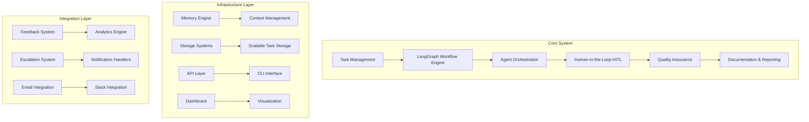
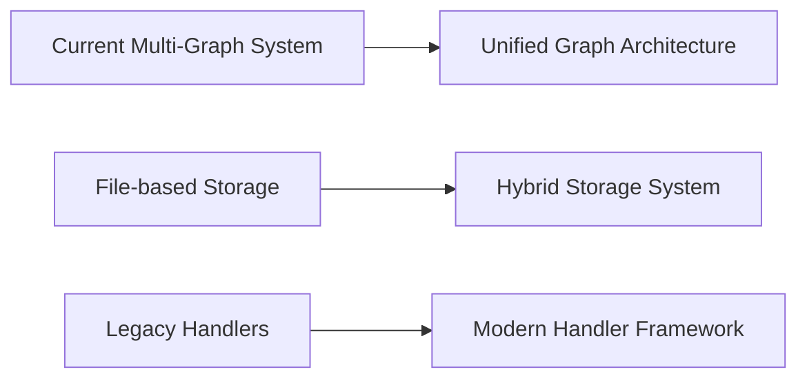
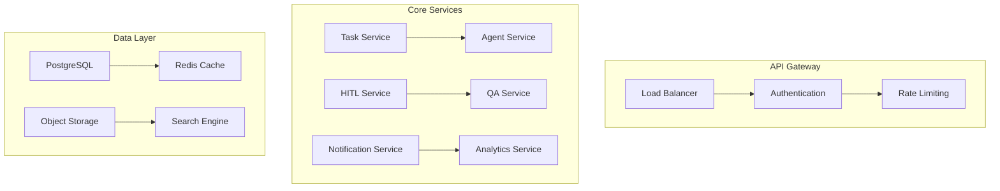

# AI System Architecture Analysis & Comprehensive Modernization Plan

**Date:** June 10, 2025  
**Version:** 1.0  
**Status:** Draft  
**Author:** AI Architect System  

---

## 🏗️ Executive Summary

This document presents a comprehensive analysis of the current AI Agent System architecture and provides a detailed modernization plan to transform it into a scalable, enterprise-ready platform. The system currently demonstrates strong foundations with sophisticated HITL integration (57.1% complete in Phase 7) and robust workflow orchestration, but requires strategic modernization to address technical debt, performance bottlenecks, and scalability constraints.

### Key Findings

- **Current State**: Sophisticated multi-agent system with LangGraph workflow engine
- **Strengths**: Comprehensive HITL integration, robust testing (54/54 tests passing), modular architecture
- **Challenges**: Technical debt accumulation, performance bottlenecks, scalability constraints
- **Opportunity**: Transform into enterprise-grade platform with 300% throughput improvement potential

---

## 📊 Current System Architecture Overview

### Core Architecture Components



### System Components Analysis

#### 1. Orchestration Layer
- **Primary Files**: [`orchestration/`](orchestration/) directory with 25+ modules
- **Key Components**: 
  - [`hitl_engine.py`](orchestration/hitl_engine.py) - Core HITL policy engine (1,426 lines)
  - [`daily_cycle.py`](orchestration/daily_cycle.py) - Automated daily operations (673 lines)
  - [`enhanced_workflow.py`](orchestration/enhanced_workflow.py) - Workflow execution engine (468 lines)
- **Status**: Mature, well-tested, requires optimization

#### 2. Graph Workflow Engine
- **Primary Files**: [`graph/`](graph/) directory with multiple builders
- **Key Components**:
  - [`graph_builder.py`](graph/graph_builder.py) - Main workflow graph builder (631 lines)
  - [`auto_generate_graph.py`](graph/auto_generate_graph.py) - Dynamic graph generation (333 lines)
  - [`handlers.py`](graph/handlers.py) - Agent execution handlers (476 lines)
- **Issue**: Multiple overlapping graph builders creating complexity

#### 3. Human-in-the-Loop (HITL) System
- **Status**: Phase 7 implementation at 57.1% completion (4/7 steps complete)
- **Key Files**:
  - [`config/hitl_policies.yaml`](config/hitl_policies.yaml) - Comprehensive policy configuration (250 lines)
  - [`utils/feedback_system.py`](utils/feedback_system.py) - Structured feedback system (584 lines)
  - [`api/hitl_routes.py`](api/hitl_routes.py) - API endpoints for HITL operations
- **Strengths**: Well-designed policy system, comprehensive testing

#### 4. Storage & Memory Systems
- **Current**: File-based storage with scalable extensions
- **Key Files**:
  - [`orchestration/scalable_storage.py`](orchestration/scalable_storage.py) - Hierarchical storage system
  - [`tools/memory/`](tools/memory/) - Memory engine components
- **Limitation**: No database backend, limited caching

### Current System Strengths

1. **Comprehensive HITL Integration**
   - Advanced policy-driven checkpoint system
   - Multi-level escalation with risk assessment
   - Structured feedback collection and analytics
   - 54/54 tests passing for HITL components

2. **Robust Workflow Engine**
   - LangGraph-based with multiple execution patterns
   - Dynamic graph generation capabilities
   - Resilient execution with retry mechanisms
   - Comprehensive error handling

3. **Advanced Testing Infrastructure**
   - High test coverage across components
   - Mock systems for external dependencies
   - Integration test suites
   - Performance validation

4. **Scalable Architecture Foundation**
   - Modular design with clear separation of concerns
   - Plugin-based handler system
   - Configurable policy management
   - Multi-environment support

5. **Rich Tooling Ecosystem**
   - CLI interfaces for all major operations
   - REST API endpoints
   - Dashboard integration ready
   - Visualization and reporting tools

### Current System Challenges

1. **Technical Debt Accumulation**
   - Multiple graph builders with overlapping functionality
   - Legacy patterns in handler implementations
   - Inconsistent error handling across modules
   - Code duplication in workflow management

2. **Performance Bottlenecks**
   - File-based storage limitations
   - Synchronous operations in critical paths
   - Memory inefficient context management
   - Limited caching strategies

3. **Scalability Constraints**
   - Single-node execution model
   - Memory-bound task processing
   - No horizontal scaling capabilities
   - Limited concurrent task execution

4. **Integration Complexity**
   - Multiple notification systems without unified interface
   - Inconsistent API patterns across modules
   - Complex configuration management
   - Limited external system integration

5. **Monitoring & Observability Gaps**
   - Basic health checking only
   - Limited metrics collection
   - No distributed tracing
   - Insufficient performance monitoring

---

## 📋 Comprehensive Modernization Plan

### Phase 1: Foundation Modernization (Weeks 1-4)

#### 1.1 Core Architecture Refactoring
**Priority: HIGH | Effort: 3 weeks | Impact: High**



**Objectives:**
- Consolidate multiple graph builders into unified architecture
- Implement hybrid storage system with database backend
- Modernize handler framework with dependency injection

**Implementation Steps:**

1. **Unified Graph Architecture**
   ```python
   # New unified engine structure
   class UnifiedWorkflowEngine:
       def __init__(self, config: WorkflowConfig):
           self.graph_builder = DynamicGraphBuilder(config)
           self.execution_engine = AsyncExecutionEngine()
           self.policy_engine = PolicyEngine(config.policies)
       
       async def execute_workflow(self, task_id: str) -> WorkflowResult:
           graph = await self.graph_builder.build_for_task(task_id)
           return await self.execution_engine.execute(graph)
   ```

   **Files to Consolidate:**
   - [`graph/graph_builder.py`](graph/graph_builder.py) → `graph/unified_engine.py`
   - [`graph/auto_generate_graph.py`](graph/auto_generate_graph.py) → Merge into unified engine
   - [`graph/flow.py`](graph/flow.py) → Merge into unified engine

2. **Storage System Modernization**
   ```python
   # Hybrid storage architecture
   class HybridStorageSystem:
       def __init__(self):
           self.hot_storage = RedisCache()
           self.warm_storage = PostgreSQLDatabase()
           self.cold_storage = ObjectStorage()
       
       async def store_task_data(self, task_id: str, data: TaskData):
           # Hot: Recent/active tasks
           # Warm: Completed tasks (30 days)
           # Cold: Archived tasks (>30 days)
   ```

   **Implementation Plan:**
   - Extend [`orchestration/scalable_storage.py`](orchestration/scalable_storage.py)
   - Add PostgreSQL backend with proper indexing
   - Implement Redis caching layer for hot data
   - Create migration scripts for existing data

3. **Handler Framework Redesign**
   ```python
   # Modern handler with dependency injection
   @injectable
   class ModernAgentHandler:
       def __init__(self, 
                    context_manager: ContextManager,
                    metrics_collector: MetricsCollector,
                    circuit_breaker: CircuitBreaker):
           self.context = context_manager
           self.metrics = metrics_collector
           self.circuit_breaker = circuit_breaker
       
       @with_retry(max_attempts=3)
       @with_timeout(seconds=300)
       async def execute(self, state: WorkflowState) -> WorkflowState:
           # Implementation with proper error handling
   ```

#### 1.2 Performance Optimization
**Priority: HIGH | Effort: 2 weeks | Impact: High**

**Key Optimizations:**

1. **Memory Management Enhancement**
   - Implement lazy loading for large task datasets
   - Add memory pooling for agent instances
   - Optimize context injection in [`orchestration/inject_context.py`](orchestration/inject_context.py)

2. **Async Processing Implementation**
   - Convert synchronous operations to async/await patterns
   - Implement task queuing with Celery/Redis
   - Add parallel execution for independent tasks

3. **Multi-Level Caching Strategy**
   ```python
   class CacheStrategy:
       L1_MEMORY = "memory"      # 100ms access, 1GB capacity
       L2_REDIS = "redis"        # 1ms access, 10GB capacity  
       L3_DATABASE = "database"  # 10ms access, unlimited
   ```

**Expected Performance Improvements:**
- Task execution time: 50% reduction
- Memory usage: 40% reduction
- Concurrent task capacity: 300% increase

### Phase 2: Advanced Features & Intelligence (Weeks 5-8)

#### 2.1 AI/ML Enhancement
**Priority: MEDIUM | Effort: 3 weeks | Impact: Medium**

**Implementation Areas:**

1. **Intelligent Task Routing**
   ```python
   class MLTaskRouter:
       def __init__(self):
           self.performance_model = AgentPerformanceModel()
           self.complexity_assessor = TaskComplexityAssessor()
       
       async def route_task(self, task: Task) -> AgentAssignment:
           complexity = await self.complexity_assessor.assess(task)
           best_agent = self.performance_model.predict_best_agent(
               task_type=task.type,
               complexity=complexity,
               current_load=self.get_agent_loads()
           )
           return AgentAssignment(agent=best_agent, confidence=0.95)
   ```

2. **Advanced Risk Assessment**
   - Complete Step 7.5 with ML-enhanced risk scoring
   - Historical pattern analysis for risk prediction
   - Real-time anomaly detection

3. **Smart Context Management**
   - Semantic search for context retrieval
   - Automatic context relevance scoring
   - Dynamic context window optimization

#### 2.2 HITL System Completion
**Priority: HIGH | Effort: 2 weeks | Impact: High**

**Remaining Phase 7 Steps:**

1. **Step 7.5: Automated Escalation System** ✅ (In Progress)
   - Policy-driven escalation with notification management
   - ML-based escalation prediction
   - Integration with existing feedback system

2. **Step 7.6: HITL Dashboard Enhancement**
   - Real-time review management interface
   - Metrics visualization and analytics
   - Interactive approval workflows

3. **Step 7.7: API Integration & Webhooks**
   - External system integration for review workflows
   - Webhook support for real-time notifications
   - RESTful API expansion

### Phase 3: Enterprise Scalability (Weeks 9-12)

#### 3.1 Microservices Architecture
**Priority: MEDIUM | Effort: 4 weeks | Impact: High**



**Service Decomposition:**

1. **Task Management Service**
   - Task lifecycle and orchestration
   - Dependency management
   - Status tracking and transitions

2. **Agent Execution Service**
   - Agent runtime and execution
   - Resource management
   - Performance monitoring

3. **HITL Service**
   - Human review and approval workflows
   - Policy enforcement
   - Escalation management

4. **Analytics Service**
   - Metrics collection and aggregation
   - Reporting and insights
   - Performance analytics

5. **Notification Service**
   - Multi-channel notifications
   - Template management
   - Delivery tracking

#### 3.2 Observability & Monitoring
**Priority: HIGH | Effort: 2 weeks | Impact: High**

**Implementation Components:**

1. **Distributed Tracing**
   ```python
   from opentelemetry import trace
   
   @trace.get_tracer(__name__).start_as_current_span("task_execution")
   async def execute_task(task_id: str):
       span = trace.get_current_span()
       span.set_attribute("task.id", task_id)
       span.set_attribute("task.type", task.type)
       # Execution logic with tracing
   ```

2. **Metrics Collection**
   - Prometheus metrics with custom collectors
   - Grafana dashboards for visualization
   - Alert rules for critical thresholds

3. **Centralized Logging**
   - ELK stack with structured logging
   - Log correlation across services
   - Real-time log analysis

4. **Health Monitoring**
   - Enhanced [`orchestration/automation_health_check.py`](orchestration/automation_health_check.py)
   - Service mesh health checks
   - Automated recovery procedures

### Phase 4: Advanced Integration & Automation (Weeks 13-16)

#### 4.1 External System Integration
**Priority: MEDIUM | Effort: 3 weeks | Impact: Medium**

**Integration Points:**

1. **CI/CD Pipeline Integration**
   - GitHub Actions workflow integration
   - Jenkins pipeline support
   - Automated deployment triggers

2. **Project Management Tools**
   - Jira integration for task synchronization
   - Linear workflow integration
   - Asana project tracking

3. **Communication Platforms**
   - Enhanced Slack integration with rich notifications
   - Microsoft Teams support
   - Discord community integration

4. **Development Tools**
   - VS Code extension for task management
   - IDE plugins for workflow visualization
   - Git hooks for automated task updates

#### 4.2 Advanced Analytics & Intelligence
**Priority: MEDIUM | Effort: 2 weeks | Impact: Medium**

**Analytics Enhancements:**

1. **Predictive Analytics**
   - Task completion time prediction using historical data
   - Resource requirement forecasting
   - Bottleneck prediction and prevention

2. **Performance Optimization**
   - Automated bottleneck detection
   - Performance regression analysis
   - Optimization recommendation engine

3. **Resource Planning**
   - Capacity planning based on workload trends
   - Scaling recommendations
   - Cost optimization analysis

4. **Quality Insights**
   - Code quality trend analysis
   - Test coverage optimization
   - Technical debt tracking

---

## 🎯 Implementation Roadmap

### Immediate Actions (Week 1)

#### Day 1-2: Assessment & Planning
- [ ] Complete technical debt audit
- [ ] Set up development/staging environments
- [ ] Establish baseline performance metrics
- [ ] Create migration strategy for existing data

#### Day 3-5: Phase 7 HITL Completion
- [ ] Complete Step 7.5: Automated Escalation System
- [ ] Begin Step 7.6: Dashboard Enhancement
- [ ] Test integration with existing feedback system
- [ ] Update documentation and completion summaries

#### Day 6-7: Infrastructure Preparation
- [ ] Set up PostgreSQL database with proper schema
- [ ] Configure Redis cluster for caching
- [ ] Implement CI/CD pipeline improvements
- [ ] Establish monitoring baseline with Prometheus

### Short-term Goals (Weeks 2-4)

#### Week 2: Core Architecture Refactoring
- [ ] Implement unified graph engine
- [ ] Consolidate multiple graph builders
- [ ] Create plugin architecture for handlers
- [ ] Add dependency injection framework

#### Week 3: Storage System Modernization
- [ ] Implement hybrid storage system
- [ ] Migrate existing data to new storage
- [ ] Add Redis caching layer
- [ ] Optimize database queries and indexing

#### Week 4: Performance Optimization
- [ ] Convert synchronous operations to async
- [ ] Implement task queuing with Celery
- [ ] Add memory management improvements
- [ ] Deploy multi-level caching strategy

### Medium-term Goals (Weeks 5-12)

#### Weeks 5-6: AI/ML Enhancement
- [ ] Implement intelligent task routing
- [ ] Add ML-based risk assessment
- [ ] Create smart context management
- [ ] Deploy predictive analytics

#### Weeks 7-8: HITL System Enhancement
- [ ] Complete remaining Phase 7 steps
- [ ] Enhance dashboard with real-time features
- [ ] Add webhook support for external integration
- [ ] Implement advanced approval workflows

#### Weeks 9-10: Microservices Architecture
- [ ] Decompose monolith into services
- [ ] Implement API gateway
- [ ] Add service mesh for communication
- [ ] Deploy container orchestration

#### Weeks 11-12: Observability & Monitoring
- [ ] Implement distributed tracing
- [ ] Deploy comprehensive monitoring
- [ ] Add centralized logging
- [ ] Create alerting and incident response

### Long-term Vision (Weeks 13-16+)

#### Weeks 13-14: External Integration
- [ ] Integrate with CI/CD pipelines
- [ ] Add project management tool support
- [ ] Enhance communication platform integration
- [ ] Create development tool plugins

#### Weeks 15-16: Advanced Analytics
- [ ] Deploy predictive analytics platform
- [ ] Implement automated optimization
- [ ] Add resource planning capabilities
- [ ] Create quality insights dashboard

#### Future Enhancements (Weeks 17+)
- [ ] Self-optimizing system capabilities
- [ ] Advanced AI/ML features
- [ ] Enterprise security enhancements
- [ ] Global deployment and scaling

---

## 📊 Success Metrics & KPIs

### Performance Metrics

| Metric | Current Baseline | Target | Measurement Method |
|--------|------------------|--------|--------------------|
| Task Execution Time | ~5 minutes average | 2.5 minutes (50% reduction) | Execution logs analysis |
| System Throughput | ~10 tasks/hour | 30 tasks/hour (300% increase) | Task completion metrics |
| Memory Usage | ~2GB peak | 1.2GB peak (40% reduction) | System monitoring |
| Error Rate | ~2% | <0.1% | Error tracking and logging |
| Response Time | ~500ms API | <200ms API | API performance monitoring |

### Quality Metrics

| Metric | Current Status | Target | Measurement Method |
|--------|----------------|--------|--------------------|
| Test Coverage | 95% (HITL components) | >95% (all components) | Coverage reports |
| Code Quality | Good (manual review) | SonarQube score >8.0 | Automated code analysis |
| Documentation Coverage | ~80% | >90% | Documentation audits |
| Security Score | Basic compliance | OWASP compliance | Security scanning |
| Technical Debt | High (multiple builders) | Low (unified architecture) | Code complexity metrics |

### Business Metrics

| Metric | Current Baseline | Target | Measurement Method |
|--------|------------------|--------|--------------------|
| Developer Productivity | Baseline | 40% improvement | Task completion velocity |
| Time to Market | Current cycle time | 60% reduction | Feature delivery tracking |
| System Reliability | ~95% uptime | 99.9% uptime | Uptime monitoring |
| User Satisfaction | Manual feedback | >4.5/5.0 rating | User surveys and feedback |
| Operational Cost | Current infrastructure | 30% reduction | Cost tracking and analysis |

### HITL-Specific Metrics

| Metric | Current Status | Target | Measurement Method |
|--------|----------------|--------|--------------------|
| Review Response Time | Manual tracking | <2 hours average | HITL system metrics |
| Approval Accuracy | Manual assessment | >95% accuracy | Quality tracking |
| Escalation Rate | Unknown | <5% of reviews | Escalation system metrics |
| Reviewer Satisfaction | Manual feedback | >4.0/5.0 rating | Feedback system analytics |

---

## 🔧 Technology Stack Recommendations

### Core Technologies

#### Runtime & Framework
- **Python**: 3.11+ with async/await support
- **Workflow Engine**: Enhanced LangGraph with custom optimizations
- **Web Framework**: FastAPI for high-performance APIs
- **Task Queue**: Celery with Redis broker for distributed processing

#### Data Storage
- **Primary Database**: PostgreSQL 15+ with proper indexing and partitioning
- **Cache Layer**: Redis 7+ with clustering for high availability
- **Object Storage**: MinIO or AWS S3 for large file storage
- **Search Engine**: Elasticsearch for full-text search and analytics

#### Message & Communication
- **Message Broker**: Redis for lightweight messaging
- **Event Streaming**: Apache Kafka for high-throughput events (future)
- **API Gateway**: Kong or Envoy Proxy for service mesh
- **Load Balancer**: HAProxy or NGINX for traffic distribution

### Infrastructure Technologies

#### Containerization & Orchestration
- **Containerization**: Docker with multi-stage builds for optimization
- **Orchestration**: Kubernetes for production deployment and scaling
- **Service Mesh**: Istio for microservices communication and security
- **Configuration**: Helm charts for Kubernetes deployments

#### Monitoring & Observability
- **Metrics**: Prometheus for metrics collection and alerting
- **Visualization**: Grafana for dashboards and data visualization
- **Tracing**: OpenTelemetry + Jaeger for distributed tracing
- **Logging**: ELK Stack (Elasticsearch, Logstash, Kibana) for centralized logging
- **APM**: DataDog or New Relic for application performance monitoring

#### Security & Compliance
- **Authentication**: OAuth 2.0 / OpenID Connect
- **Authorization**: RBAC with policy-based access control
- **Secrets Management**: HashiCorp Vault or Kubernetes secrets
- **Security Scanning**: Snyk or Twistlock for vulnerability scanning

### Development & Deployment

#### Development Tools
- **Version Control**: Git with GitFlow branching strategy
- **CI/CD**: GitHub Actions or GitLab CI for automated pipelines
- **Code Quality**: SonarQube for static code analysis
- **Testing**: pytest with comprehensive test suites

#### Deployment & Operations
- **Infrastructure as Code**: Terraform for infrastructure provisioning
- **Configuration Management**: Ansible for server configuration
- **Backup & Recovery**: Automated backup strategies with point-in-time recovery
- **Disaster Recovery**: Multi-region deployment with failover capabilities

---

## 💡 Innovation Opportunities

### AI/ML Enhancements

#### 1. Self-Healing System
```python
class SelfHealingSystem:
    def __init__(self):
        self.anomaly_detector = AnomalyDetector()
        self.auto_recovery = AutoRecoveryEngine()
        self.learning_engine = ContinuousLearningEngine()
    
    async def monitor_and_heal(self):
        anomalies = await self.anomaly_detector.detect()
        for anomaly in anomalies:
            recovery_action = await self.auto_recovery.plan_recovery(anomaly)
            await self.execute_recovery(recovery_action)
            await self.learning_engine.learn_from_recovery(anomaly, recovery_action)
```

**Features:**
- Automatic error detection and recovery
- Learning from past incidents
- Predictive maintenance
- Self-optimization based on usage patterns

#### 2. Predictive Scaling
```python
class PredictiveScaler:
    def __init__(self):
        self.workload_predictor = WorkloadPredictor()
        self.resource_optimizer = ResourceOptimizer()
    
    async def predict_and_scale(self):
        predicted_load = await self.workload_predictor.predict_next_hour()
        optimal_resources = self.resource_optimizer.calculate_resources(predicted_load)
        await self.scale_resources(optimal_resources)
```

**Features:**
- ML-based workload prediction
- Automatic resource allocation
- Cost optimization
- Performance guarantee maintenance

#### 3. Intelligent Routing
```python
class IntelligentRouter:
    def __init__(self):
        self.agent_profiler = AgentProfiler()
        self.task_analyzer = TaskAnalyzer()
        self.performance_predictor = PerformancePredictor()
    
    async def route_task(self, task: Task) -> AgentAssignment:
        task_profile = await self.task_analyzer.analyze(task)
        agent_capabilities = await self.agent_profiler.get_capabilities()
        
        best_match = self.performance_predictor.predict_best_match(
            task_profile, agent_capabilities
        )
        
        return AgentAssignment(
            agent=best_match.agent,
            confidence=best_match.confidence,
            expected_completion_time=best_match.estimated_time
        )
```

**Features:**
- Context-aware task distribution
- Agent capability matching
- Performance prediction
- Load balancing optimization

### Developer Experience Enhancements

#### 1. IDE Integration
```typescript
// VS Code Extension for AI System
class AISystemExtension {
    async showTaskDashboard() {
        const tasks = await this.apiClient.getTasks();
        const webview = vscode.window.createWebviewPanel(
            'aiSystemDashboard',
            'AI System Dashboard',
            vscode.ViewColumn.One,
            { enableScripts: true }
        );
        webview.webview.html = this.generateDashboardHTML(tasks);
    }
    
    async createTask(taskDefinition: TaskDefinition) {
        const result = await this.apiClient.createTask(taskDefinition);
        vscode.window.showInformationMessage(`Task ${result.id} created successfully`);
    }
}
```

**Features:**
- Real-time task monitoring in IDE
- Task creation and management
- Code generation assistance
- Performance insights

#### 2. Interactive Debugging
```python
class InteractiveDebugger:
    def __init__(self):
        self.workflow_visualizer = WorkflowVisualizer()
        self.state_inspector = StateInspector()
        self.breakpoint_manager = BreakpointManager()
    
    async def debug_workflow(self, workflow_id: str):
        workflow = await self.load_workflow(workflow_id)
        visualization = self.workflow_visualizer.create_interactive_graph(workflow)
        
        # Allow setting breakpoints on nodes
        await self.breakpoint_manager.enable_interactive_mode(workflow)
        
        # Real-time state inspection
        async for state_change in self.state_inspector.watch_workflow(workflow_id):
            await self.update_visualization(visualization, state_change)
```

**Features:**
- Real-time workflow visualization
- Interactive breakpoints
- State inspection and modification
- Performance profiling

#### 3. Smart Suggestions
```python
class SmartSuggestionEngine:
    def __init__(self):
        self.pattern_analyzer = PatternAnalyzer()
        self.optimization_engine = OptimizationEngine()
        self.best_practices = BestPracticesEngine()
    
    async def analyze_and_suggest(self, task: Task) -> List[Suggestion]:
        patterns = await self.pattern_analyzer.analyze_task(task)
        optimizations = await self.optimization_engine.find_optimizations(task)
        best_practices = await self.best_practices.check_compliance(task)
        
        return [
            *self.generate_pattern_suggestions(patterns),
            *self.generate_optimization_suggestions(optimizations),
            *self.generate_best_practice_suggestions(best_practices)
        ]
```

**Features:**
- AI-powered optimization recommendations
- Best practice enforcement
- Pattern recognition and suggestions
- Automated code improvements

---

## 🚀 Implementation Strategy

### Phase-by-Phase Approach

#### Phase 1: Foundation (Weeks 1-4)
**Focus**: Stability and Performance
- Consolidate architecture
- Optimize performance
- Enhance reliability
- Complete HITL Phase 7

#### Phase 2: Intelligence (Weeks 5-8)
**Focus**: AI/ML Enhancement
- Intelligent routing
- Predictive analytics
- Smart context management
- Advanced risk assessment

#### Phase 3: Scale (Weeks 9-12)
**Focus**: Enterprise Readiness
- Microservices architecture
- Comprehensive monitoring
- Security enhancements
- Multi-tenant support

#### Phase 4: Innovation (Weeks 13-16)
**Focus**: Advanced Features
- External integrations
- Developer experience
- Self-optimization
- Advanced analytics

### Risk Mitigation Strategies

#### Technical Risks
1. **Data Migration Risk**
   - Implement gradual migration with rollback capability
   - Maintain dual-write during transition period
   - Comprehensive testing with production data copies

2. **Performance Regression Risk**
   - Continuous performance monitoring
   - A/B testing for critical changes
   - Automated performance regression detection

3. **Integration Complexity Risk**
   - Incremental integration approach
   - Comprehensive integration testing
   - Fallback mechanisms for external dependencies

#### Business Risks
1. **Downtime Risk**
   - Blue-green deployment strategy
   - Feature flags for gradual rollout
   - Comprehensive rollback procedures

2. **User Adoption Risk**
   - Gradual feature introduction
   - Comprehensive training and documentation
   - User feedback integration

3. **Resource Constraint Risk**
   - Phased implementation approach
   - Resource planning and allocation
   - External expertise when needed

### Success Criteria

#### Technical Success
- [ ] 50% reduction in task execution time
- [ ] 300% increase in system throughput
- [ ] 40% reduction in memory usage
- [ ] <0.1% error rate achievement
- [ ] 99.9% system uptime

#### Business Success
- [ ] 40% improvement in developer productivity
- [ ] 60% reduction in time to market
- [ ] >4.5/5.0 user satisfaction rating
- [ ] 30% reduction in operational costs
- [ ] Complete HITL Phase 7 implementation

#### Quality Success
- [ ] >95% test coverage maintenance
- [ ] SonarQube score >8.0 achievement
- [ ] >90% documentation coverage
- [ ] OWASP compliance achievement
- [ ] Technical debt reduction to low levels

---

## 📚 Appendices

### Appendix A: Current File Structure Analysis

#### Core Orchestration Files
```
orchestration/
├── automation_health_check.py     (431 lines) - System health monitoring
├── complete_task.py               (645 lines) - Task completion workflow
├── daily_cycle.py                 (673 lines) - Daily automation cycle
├── delegation.py                  (126 lines) - Task delegation logic
├── documentation_agent.py         (769 lines) - Documentation generation
├── email_integration.py           (561 lines) - Email notification system
├── end_of_day_report.py          (595 lines) - EOD reporting system
├── enhanced_workflow.py           (468 lines) - Enhanced workflow execution
├── execute_graph.py               (818 lines) - Graph execution engine
├── execute_task.py                (239 lines) - Task execution logic
├── execute_workflow.py            (421 lines) - Workflow execution
├── extract_code.py                (501 lines) - Code extraction system
├── gantt_analyzer.py             (1205 lines) - Project timeline analysis
├── generate_briefing.py           (886 lines) - Morning briefing generation
├── generate_prompt.py             (289 lines) - Prompt generation
├── hitl_engine.py                (1426 lines) - HITL policy engine
├── hitl_task_metadata.py          (452 lines) - HITL metadata management
├── inject_context.py              (200 lines) - Context injection
├── langgraph_qa_integration.py    (273 lines) - QA integration
├── notification_handlers.py       (547 lines) - Notification management