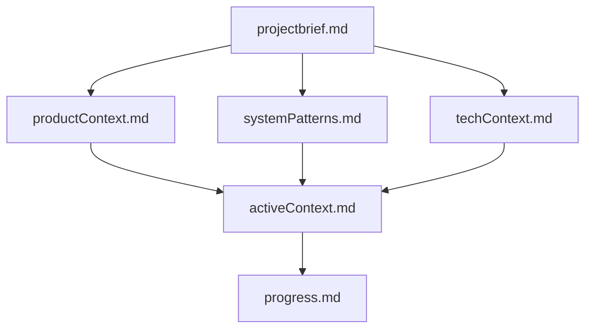

# Memory Bank: AI Agent System Knowledge Repository

## Overview

The Memory Bank serves as the foundational knowledge management system for the AI Agent System. It provides structured, hierarchical context that agents can access to make informed decisions and maintain consistency across operations.

## File Structure & Hierarchy

The Memory Bank follows a hierarchical structure where files build upon each other:

```
memory-bank/
├── README.md              # This documentation
├── projectbrief.md        # Foundation document (START HERE)
├── productContext.md      # Why this project exists
├── systemPatterns.md      # Architecture and design patterns
├── techContext.md         # Technology stack and setup
├── activeContext.md       # Current work focus and decisions
└── progress.md           # Current status and what's left to build
```

### File Dependencies



## Core Files Description

### 1. `projectbrief.md` - Foundation Document
**Purpose**: Defines core requirements, scope, and success criteria
**Contains**:
- Project overview and primary goals
- Key capabilities required
- Technical constraints
- Success criteria
- Project scope (in/out)

**When to Read**: Always read first - shapes understanding of all other files

### 2. `productContext.md` - Product Vision
**Purpose**: Explains why this project exists and how it should work
**Contains**:
- Problem statement and solution vision
- Problems the system solves
- User experience goals
- Success metrics

**When to Read**: When understanding business context and user needs

### 3. `systemPatterns.md` - Architecture Guide
**Purpose**: Documents system architecture and design patterns
**Contains**:
- Core architecture patterns
- Agent design patterns
- Communication protocols
- Quality assurance patterns
- Critical implementation paths

**When to Read**: When working on system architecture or agent coordination

### 4. `techContext.md` - Technology Stack
**Purpose**: Comprehensive technology and setup documentation
**Contains**:
- Core technologies and versions
- Development environment setup
- Testing framework
- Security and performance considerations
- Tool integration architecture

**When to Read**: When setting up development environment or working with specific technologies

### 5. `activeContext.md` - Current Work Focus
**Purpose**: Documents current work, recent changes, and active decisions
**Contains**:
- Current work focus and session goals
- Recent changes and discoveries
- Next steps (immediate, short-term, medium-term)
- Active decisions and considerations
- Important patterns and preferences
- Current challenges

**When to Read**: At the start of every session to understand current state

### 6. `progress.md` - Status & Development State
**Purpose**: Tracks what works, what's left to build, and system evolution
**Contains**:
- Operational components (what works)
- What's left to build
- Current status by component
- Known issues and limitations
- Evolution of project decisions
- Performance metrics
- Development roadmap

**When to Read**: When assessing system capabilities or planning next steps

## Usage Guidelines

### For Agents
1. **Start with `projectbrief.md`** to understand core project goals
2. **Read `activeContext.md`** to understand current work focus
3. **Reference specific files** based on task requirements:
   - Architecture tasks → `systemPatterns.md`
   - Technical setup → `techContext.md`
   - Business context → `productContext.md`
   - Status assessment → `progress.md`

### For Context Retrieval
```python
# Example context retrieval patterns
context_topics = {
    'system-architecture': 'systemPatterns.md',
    'project-goals': 'projectbrief.md + productContext.md',
    'technical-stack': 'techContext.md',
    'current-status': 'activeContext.md + progress.md'
}
```

### Update Triggers
The Memory Bank should be updated when:
1. **Major system changes** occur
2. **User explicitly requests** "update memory bank"
3. **Context gaps** are identified during agent operations
4. **Performance issues** with context retrieval are detected

## Memory Bank Principles

### 1. Hierarchical Context
- Files build upon each other logically
- Prevents information duplication
- Enables progressive detail access

### 2. Current State Focus
- Always reflects current system state
- Historical context only when relevant
- Forward-looking with clear next steps

### 3. Agent-Centric Design
- Information structured for agent decision-making
- Technical details balanced with business context
- Clear, actionable guidance

### 4. Maintenance Discipline
- Regular updates to maintain accuracy
- Version tracking for change detection
- Quality standards for consistency

## Integration with AI Agent System

### Memory Engine Integration
The Memory Bank integrates with the existing Memory Engine (`tools/memory_engine.py`) to provide:
- **Vector-based retrieval** of relevant context
- **Topic-based filtering** for agent-specific needs
- **Caching optimization** for frequently accessed content
- **Security compliance** with PII protection

### Agent Workflow Integration
Agents access Memory Bank context through:
1. **Task-based queries** using context topics
2. **Role-specific filtering** based on agent type
3. **Progressive context loading** from general to specific
4. **Feedback loops** to improve context relevance

### LangGraph Workflow Integration
The workflow engine uses Memory Bank for:
- **Routing decisions** based on current system state
- **Context injection** before task execution
- **Quality validation** against established patterns
- **Progress tracking** and status reporting

## Maintenance Schedule

### Regular Updates
- **After major changes**: Immediate update of affected files
- **Weekly review**: Validate `activeContext.md` and `progress.md`
- **Monthly review**: Comprehensive review of all files
- **Quarterly review**: Strategic review and optimization

### Quality Checks
- **Accuracy**: Information reflects current system state
- **Relevance**: Content serves agent decision-making needs
- **Clarity**: Technical language without ambiguity
- **Completeness**: All aspects agents need are covered

## Version History

- **v1.0** (Current): Initial Memory Bank creation with all core files
  - Established hierarchical structure
  - Documented current system state (post-security audit)
  - Created integration patterns with existing system
